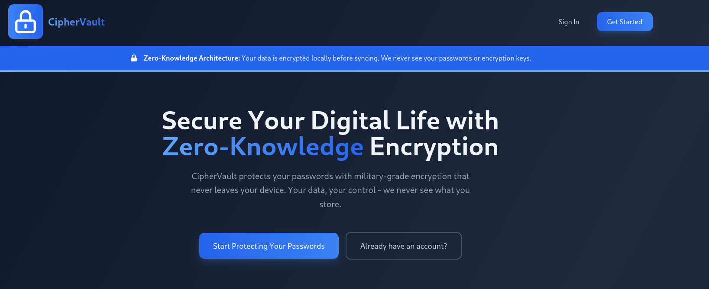
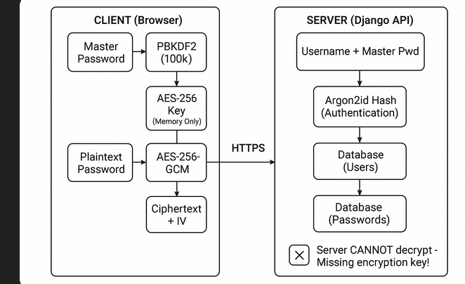

#  Zero-Knowledge Password Manager

Zero-knowledge password manager where **the server never sees your decrypted passwords**. Built with modern web technologies and cryptographic best practices, this application ensures your sensitive data remains private through client-side encryption.

  
   
  

---

##  Key Features

-  **Zero-Knowledge Architecture** - Server only stores encrypted data
-  **Client-Side AES-256-GCM Encryption** - All encryption happens in your browser
-  **Argon2id Password Hashing** - Industry-standard password security
-  **Master Password Never Stored** - Even we can't access your passwords
-  **Folder Organization** - Group passwords by categories
-  **Favorites** - Quick access to frequently used passwords
-  **Search & Filter** - Find passwords instantly
-  **Auto-Lock** - Automatic logout after 10 minutes of inactivity
-  **RESTful API** - Clean, documented backend architecture
-  **Modern UI** - Built with Tailwind CSS for a clean, responsive interface
-  **Rate Limiting** - Protection against brute-force attacks
-  **CORS-Enabled** - Secure cross-origin resource sharing

---

##  Tech Stack

### Backend
- **Framework:** Django 5.1 + Django REST Framework 3.15
- **Database:** SQLite (development) / PostgreSQL (production-ready)
- **Password Hashing:** Argon2id via `django-argon2`
- **Authentication:** Session-based with CSRF exemption for API
- **Rate Limiting:** Built-in DRF throttling
- **CORS:** `django-cors-headers`

### Frontend
- **Framework:** Next.js 14 (App Router)
- **Language:** JavaScript (ES6+)
- **Styling:** Tailwind CSS
- **State Management:** Zustand
- **HTTP Client:** Axios
- **Encryption:** Web Crypto API (browser-native)

### Cryptography
- **Encryption Algorithm:** AES-256-GCM
- **Key Derivation:** PBKDF2 (100,000 iterations, SHA-256)
- **Password Hashing:** Argon2id
- **IV Generation:** Cryptographically secure random values

##  System Architecture Overview

### Zero-Knowledge Flow

This password manager implements a **true zero-knowledge architecture** [web:19][web:181], meaning:

1. **Master Password Never Leaves Your Device** - It's used only for local key derivation
2. **All Encryption Happens Client-Side** - Passwords are encrypted in your browser before transmission
3. **Server Stores Only Ciphertext** - The backend never sees plaintext passwords
4. **You Control the Keys** - Only you can decrypt your data

### Architecture Diagram

  
   
  

### Security Model

| Component | Purpose | Location |
|-----------|---------|----------|
| Master Password | User authentication + key derivation | Client only (never sent) |
| Argon2 Hash | Server-side authentication | Server database |
| Encryption Key | Decrypt/encrypt passwords | Client memory (never sent) |
| Ciphertext + IV | Encrypted password storage | Server database |
| Salt | Key derivation randomness | Client localStorage |

### Threat Model Mitigations

- [x] **Database Breach** - Attacker gets only encrypted data (useless without master password)
- [x] **Man-in-the-Middle** - HTTPS ensures encrypted channel; no plaintext transmitted
- [x] **Server Compromise** - Server has no decryption keys; cannot read passwords
- [x] **Brute Force** - Rate limiting + Argon2 computational cost
- [x] **Replay Attacks** - CSRF protection + session management
- [x] **Password Reuse** - Each password encrypted with unique IV

### 6. Threat Mitigation Summary

| Threat | Mitigation | Status |
|--------|------------|--------|
| **Database Breach** | All passwords encrypted with user-specific keys | [x] Mitigated |
| **MITM Attack** | HTTPS + No plaintext transmission | [x] Mitigated |
| **Server Compromise** | Zero-knowledge: server can't decrypt | [x] Mitigated |
| **Brute Force (Login)** | Rate limiting + Argon2 cost | [x] Mitigated |
| **Brute Force (Encryption)** | AES-256 (2^256 keyspace) | [x] Mitigated |
| **Rainbow Tables** | Random salts per user | [x] Mitigated |
| **Replay Attack** | CSRF tokens + session management | [x] Mitigated |
| **XSS** | Content Security Policy + HTTPOnly cookies |  Partial |
| **Phishing** | User education required |  User responsibility |

### 7. Security Best Practices Implemented

-  No master password storage
-  No encryption keys in localStorage
-  Auto-lock after inactivity
-  HTTPS enforcement (production)
-  CORS restrictions
-  Rate limiting
-  CSRF protection
-  Input validation
-  Parameterized queries (SQL injection prevention)
-  Secure session cookies

##  Challenges & Difficulties Encountered

### 1. **Circular Import Issues with Django Settings**

**Problem:** When creating a custom `CsrfExemptSessionAuthentication` class directly in `views.py`, Django's settings attempted to import the module before REST Framework was fully initialized, causing circular dependency errors.

**Solution:** Moved the authentication class to a separate `authentication.py` file to break the circular dependency chain. This taught me the importance of module separation and Django's initialization order.

### 2. **CORS Configuration Complexity**

**Problem:** Frontend requests were blocked with "CORS Missing Allow Origin" errors despite having `django-cors-headers` installed.

**Solution:** Required careful ordering of middleware (CorsMiddleware must come before CommonMiddleware) and explicit configuration of `CORS_ALLOWED_ORIGINS`, `CORS_ALLOW_CREDENTIALS`, and `CSRF_TRUSTED_ORIGINS`. Testing with different browsers helped identify the exact headers needed.

### 3. **Web Crypto API Limitations**

**Problem:** Web Crypto API operations are asynchronous and promise-based, making state management complex, especially during rapid encrypt/decrypt operations.

**Solution:** Implemented proper async/await patterns and cached the derived encryption key in Zustand state. This avoided re-deriving keys on every operation while maintaining security.

### 4. **Salt Storage Strategy**

**Problem:** Deciding where to store the user's salt for key derivation without compromising security. Options were: server-side, localStorage, or derived from username.

**Solution:** Stored salt in localStorage (per-user), generated during registration. This balances security (random, user-specific) with practicality (persistent across sessions). Trade-off: If user clears browser data, they lose access unless they re-register.

### 5. **PostgreSQL Migration Conflicts**

**Problem:** During development, switching between PostgreSQL and SQLite caused migration conflicts where `auth_user` table wasn't created properly.

**Solution:** Learned to properly reset migrations: delete migration files, drop/recreate database, then re-run migrations from scratch. SQLite proved simpler for local development.

### 6. **Session vs JWT Authentication**

**Problem:** Deciding between session-based auth (simpler, stateful) vs JWT (stateless, scalable) for the API.

**Solution:** Chose session-based authentication with cookies for simplicity in a single-domain setup. For a microservices architecture, JWT would be preferred. Added CSRF exemption for API-only endpoints.

### 7. **Next.js 14 App Router Learning Curve**

**Problem:** Next.js 14's App Router has different patterns than Pages Router (e.g., `'use client'` directive, server components default).

**Solution:** Extensively read the documentation and ensured all interactive components were properly marked as client components. The `useRouter` from `next/navigation` (not `next/router`) was a key difference.

### 8. **Zustand State Persistence**

**Problem:** Storing the encryption key in Zustand state meant it was lost on page refresh, requiring re-login.

**Solution:** This is intentional for security (key should never be persisted), but required user education about the auto-lock feature and the need to re-authenticate after browser refresh.

### 9. **IV Storage and Management**

**Problem:** Understanding that the IV must be stored alongside ciphertext but doesn't need to be secret (only unique).

**Solution:** Researched GCM mode specifications and learned IVs can be stored in plaintext. Implemented Base64 encoding for clean transmission and storage.

### 10. **Argon2 Installation on Windows**

**Problem:** `argon2-cffi` has binary dependencies that sometimes fail to compile on Windows.

**Solution:** Used pre-built wheels from PyPI and ensured Visual C++ Build Tools were installed. Documented this requirement for Windows users.

##  Roadmap

###  Core Features 
- [x] Zero-knowledge encryption architecture
- [x] User registration and authentication
- [x] Password CRUD operations
- [x] Search and filtering
- [x] Folder organization
- [x] Favorites functionality
- [ ] Auto-lock mechanism

###  Enhanced Security ( In Progress)
- [ ] Two-factor authentication (TOTP)
- [ ] Password strength meter
- [ ] Compromised password detection (Have I Been Pwned API)
- [ ] Security audit logging
- [ ] Password generation with customizable rules
- [ ] Biometric authentication (WebAuthn)

